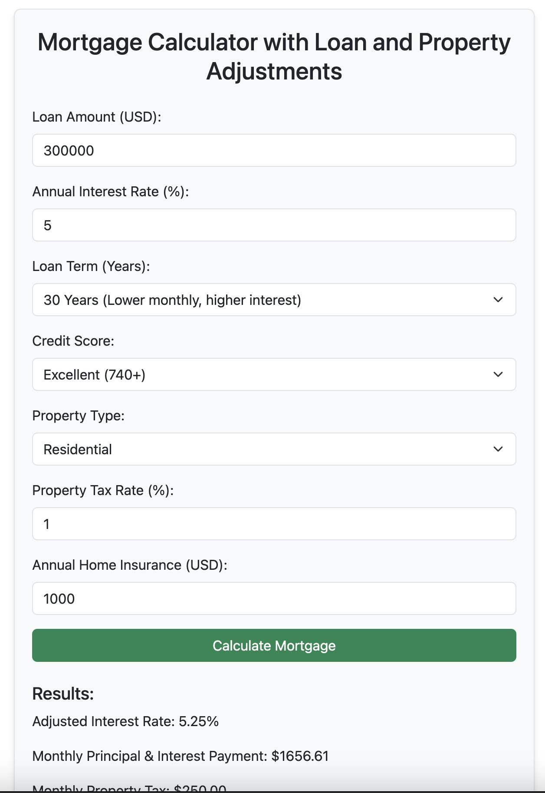

# Advanced Mortgage Calculator

## Overview
This project provides an **Advanced Mortgage Calculator** that allows users to calculate their monthly mortgage payments, adjusted for various factors such as loan amount, interest rate, credit score, property type, property tax, and home insurance. The calculator is built using **HTML**, **CSS**, and **JavaScript**, with **Bootstrap** for styling.

## Features
- Adjustable loan term with multiple options (1 to 30 years).
- Dynamic interest rate adjustment based on credit score and property type.
- Inclusion of property tax rate and annual home insurance in the calculation.
- Displays detailed results including:

  - Adjusted interest rate.
  - Monthly principal and interest payment.
  - Monthly property tax.
  - Monthly home insurance.
  - Total monthly payment.
  - Total loan cost including interest.

## Technologies Used

- **HTML5**: For structure and layout.
- **CSS3**: For styling.
- **Bootstrap 5**: For responsive design and UI components.
- **JavaScript**: For dynamic calculations.

## Usage

1. Clone the repository or download the HTML file.
2. Open the file `loanapp.html` in any web browser.
3. Fill in the required fields:

   - Loan Amount
   - Annual Interest Rate
   - Loan Term
   - Credit Score
   - Property Type
   - Property Tax Rate
   - Annual Home Insurance

4. Click the "Calculate Mortgage" button to see the results.

## Calculation Logic

- **Adjusted Interest Rate**: Base interest rate adjusted for credit score and property type.
- **Monthly Principal and Interest**: Calculated using the formula:

  \[
  M = P \frac{r(1 + r)^n}{(1 + r)^n - 1}
  \]

  Where:
  - \( M \): Monthly payment
  - \( P \): Loan amount
  - \( r \): Monthly interest rate
  - \( n \): Number of payments

- **Property Tax and Insurance**: Calculated as monthly equivalents.
- **Total Loan Cost**: Sum of all monthly payments over the loan term.

## File Structure

- `loanapp.html`: Main HTML file with embedded CSS and JavaScript.
- **Bootstrap CDN**: Used for styling and responsive design.

## How to Run
1. Ensure you have a modern web browser installed.
2. Download the file and open it locally, or host it on a web server.
3. Interact with the calculator by entering data and clicking "Calculate Mortgage."

## Screenshots
- **Input Form**: A user-friendly form to input loan and property details.
- **Results Section**: Displays calculated results dynamically after submitting the form.

---

Developed over ginger tea in weekend by: **schnaror@gmail.com**

Note:

I always stay away from loan / morgage or credit cards etc, and absolutely hate these instruments apart form just maintaining good CIBIL credit score.

